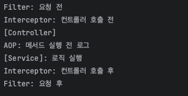

# 공통 관심사(Cross-Cutting Concern) 분리

웹 애플리케이션에서 **인증, 로깅, 트랜잭션 처리**와 같은 공통 관심사를 분리하는 방법을 정리합니다.

---

## 1. Filter (서블릿 레벨)

- 서블릿 컨테이너가 제공하는 기능
- 클라이언트 요청이 Servlet에 도달하기 전과 응답이 나가기 전에 처리
- 인증, 로깅, 공용 헤더 설정 등 **웹 요청 전후 처리**에 적합

```java
@WebFilter
public class LogFilter implements Filter {
    @Override
    public void doFilter(ServletRequest request, ServletResponse response, FilterChain chain)
            throws IOException, ServletException {
        System.out.println("Filter: 요청 전");
        chain.doFilter(request, response); // 다음 필터 또는 서블릿 호출
        System.out.println("Filter: 요청 후");
    }
}
```

```java
@SpringBootApplication
@ServletComponentScan
public class CrossCutApplication {
    public static void main(String[] args) {
        SpringApplication.run(CrossCutApplication.class, args);
    }
}
```

## 2. Interceptor (스프링 레벨)

- Spring MVC에서 제공
- DispatcherServlet → Controller → View 흐름 중간에 요청/응답 가로채기 
- 주로 인증, 권한 체크, 로깅 등에 사용 
- 컨트롤러 전/후, 뷰 렌더링 전/후 총 3단계 메서드 제공 
  - preHandle() : 컨트롤러 호출 전 
  - postHandle() : 컨트롤러 호출 후, 뷰 렌더링 전 
  - afterCompletion() : 뷰 렌더링 후

```java
@Component
public class LogInterceptor implements HandlerInterceptor {
    @Override
    public boolean preHandle(HttpServletRequest request, HttpServletResponse response, Object handler)
            throws Exception {
        System.out.println("Interceptor: 컨트롤러 호출 전");
        return true;
    }
}
```

```java
@Configuration
public class WebConfig implements WebMvcConfigurer {
    private final LogInterceptor logInterceptor;

    public WebConfig(LogInterceptor logInterceptor) {
        this.logInterceptor = logInterceptor;
    }

    @Override
    public void addInterceptors(InterceptorRegistry registry) {
        registry.addInterceptor(logInterceptor)
                .addPathPatterns("/**");    // 모든 요청에 적용
    }
}

```

## 3. AOP (Aspect-Oriented Programming)

- 메서드 호출 전후, 예외 발생 시, 특정 패턴에 맞는 코드 실행 가능 
- 인증, 로깅, 트랜잭션, 캐싱 등 공통 관심사를 비즈니스 코드와 분리 
- 프록시 기반으로 동작 
- 클래스, 메서드 단위로 적용 가능 
- @Aspect, @Before, @After, @Around 사용

```java
@Aspect
@Component
public class LogAspect {
    @Before("execution(* com.example.demo.crosscut.src.service.*.*(..))")
    public void logBefore() {
        System.out.println("AOP: 메서드 실행 전 로그");
    }
}

```

## 4. Filter vs Interceptor vs AOP 비교
| 구분    | Filter        | Interceptor                  | AOP             |
| ----- | ------------- | ---------------------------- | --------------- |
| 위치    | 서블릿 컨테이너      | Spring MVC DispatcherServlet | 스프링 빈, 메서드 단위   |
| 적용 시점 | 요청/응답 시       | 컨트롤러 전후                      | 메서드 호출 전/후/예외   |
| 대상    | 모든 서블릿/JSP    | Controller                   | 특정 클래스/메서드      |
| 용도    | 인증, 로깅, 공용 헤더 | 인증, 권한 체크, 로깅                | 트랜잭션, 로깅, 공통 기능 |
| 제어 범위 | HTTP 요청/응답    | Controller 처리 흐름             | 모든 메서드/비즈니스 로직  |


## 5. 실행 순서


```
클라이언트 요청
      │
      ▼
+-----------------+
|     Filter      |
|  (서블릿 레벨)  |
+-----------------+
      │
      ▼
+-----------------+
|   Interceptor   |
|  (Spring MVC)   |
+-----------------+
      │
      ▼
+-----------------+
|   Controller    |
+-----------------+
      │
      ▼
+-----------------+
|     Service     |
+-----------------+
      │
      ▼
+-----------------+
|       AOP       |
| (메서드 단위 로그)|
+-----------------+
      │
      ▼
클라이언트 응답
```

- Filter : HTTP 요청/응답 레벨, 서블릿 컨테이너에서 동작
- Interceptor : Spring MVC Controller 전후, 요청 흐름 제어
- Controller : 요청 처리 및 서비스 호출
- Service : 핵심 비즈니스 로직
- AOP : 서비스 메서드 호출 전후, 예외 처리 등 공통 관심사 적용

### 핵심 포인트
- Filter → HTTP 요청/응답 레벨, 서블릿 컨테이너
- Interceptor → Spring MVC Controller 전후, 요청 흐름 제어
- AOP → 메서드 단위, 공통 관심사 처리, 비즈니스 로직과 완전히 분리